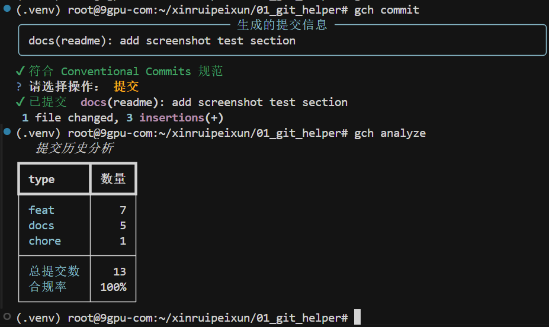
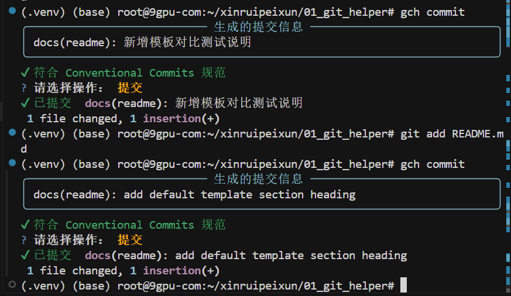
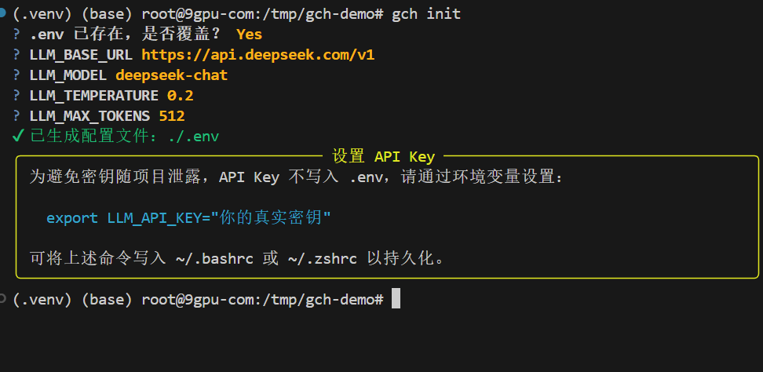
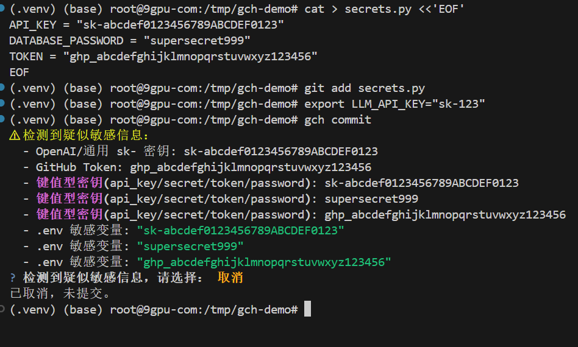
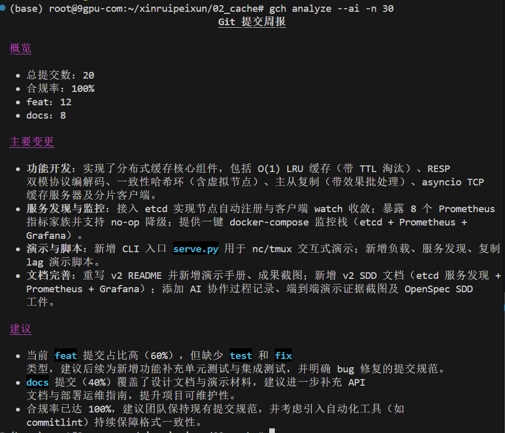
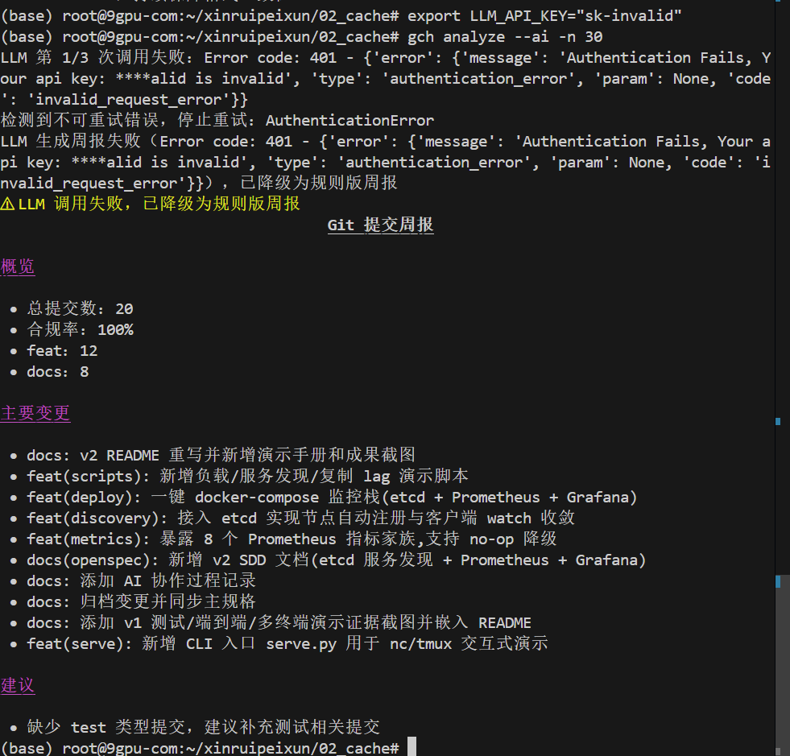
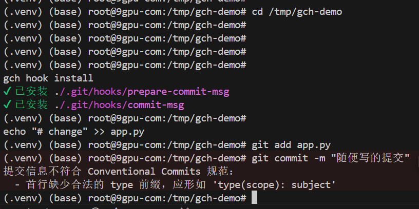

# Git Commit Helper（智能 Git 提交助手）

> 校招 AI Coding 入职培训课题 **SD-05**。一个命令行工具：读取暂存区改动，调用 LLM 生成符合
> [Conventional Commits](https://www.conventionalcommits.org/) 规范的提交信息，校验并交互确认后自动提交，并支持提交历史分析与 LLM 周报生成。

## 功能总览

### 标准版（v1）
- **读取暂存区改动**：`git diff --staged`，无暂存改动或非 Git 仓库时给出友好提示
- **LLM 生成提交信息**：符合 Conventional Commits 规范，单条输出
- **格式校验**：独立模块校验 type / subject / 首行长度 / 正文空行，生成后自动校验
- **交互确认**：提交 / 编辑后提交 / 取消（编辑后回到菜单的完整闭环）
- **自定义 prompt 模板**：通过 Jinja2 模板覆盖默认生成风格
- **API 失败降级**：超时/限流时指数退避重试（鉴权类错误立即停止），耗尽后回退模板兜底，流程不中断
- **提交历史分析**：统计类型分布、提交数与规范合规率
- **多 LLM 提供商**：通过 `.env` 切换（DeepSeek / 通义 / Kimi / Ollama / OpenAI 等，均兼容 OpenAI 协议）

### 增强版（v2）
- **一键安全初始化** `gch init`：生成 `.env` 仅含非敏感配置，API Key **强制走环境变量、永不入项目**
- **敏感信息防护**：发送 LLM 前扫描 `sk-`/GitHub Token/键值密钥/.env 变量/私钥头等，命中后「脱敏后继续 / 取消」
  CLI 与 git hook 路径策略一致（`security.scan_and_redact`）
- **环境自检** `gch doctor`：检查 Python / git / 仓库 / `.env` / LLM 配置 / 依赖，输出诊断表与修复建议
- **历史分析导出 Markdown** `gch analyze -m report.md`
- **LLM 提交周报** `gch analyze --ai`：生成「概览 / 主要变更 / 建议」三段周报，LLM 不可用时降级为规则版
- **Git hook 自动化** `gch hook install`：`prepare-commit-msg`（自动生成）+ `commit-msg`（校验阻止）
- **健壮性**：git 命令加超时、commit 编辑闭环、写报告自动建目录、hook 脚本固化 `sys.executable`

## 环境要求

- Python ≥ 3.9
- Git
- 一个可访问的 LLM API（兼容 OpenAI 协议）
- Node.js ≥ 18（仅 OpenSpec/SDD 流程需要）

## 安装与配置

```bash
# 1. 创建并激活虚拟环境
python -m venv .venv && source .venv/bin/activate

# 2. 安装项目（运行依赖已声明在 pyproject.toml，自动安装）
pip install -e .          # 运行
pip install -e ".[dev]"   # 含测试依赖（pytest 等）

# 3. 初始化配置（交互式生成 .env，不含密钥）
gch init

# 4. 设置 API Key（不写入项目文件，避免泄露）
export LLM_API_KEY="你的真实密钥"
```

> **安全约定**：API Key 一律通过**环境变量** `LLM_API_KEY` 注入，**不写入** `.env` 或任何项目文件。
> 环境变量优先级高于 `.env`，因此项目内永远不出现明文密钥。可将 `export` 写入 `~/.bashrc` / `~/.zshrc` 持久化。

### `gch init` 初始化配置

```bash
gch init            # 交互式询问 base_url/model 等，生成 .env（不含密钥）
gch init --yes      # 用默认值非交互生成
gch init --force    # 已存在 .env 时覆盖
```

生成完成后：
- 未检测到 `LLM_API_KEY` 环境变量 → 显示黄色「设置 API Key」面板，引导 `export`
- 已检测到 → 显示绿色 `✔ 已检测到环境变量 LLM_API_KEY`

## 使用

```bash
# 暂存改动
git add .

# 生成提交信息并交互确认后提交
gch commit

# 分析最近 N 条提交（类型分布 + 合规率）
gch analyze -n 50

# 也可用模块方式调用
python -m git_commit_helper commit
```

`gch commit` 流程：读取 staged diff → 敏感扫描（命中则脱敏/取消）→ LLM 生成 → 格式校验 → 终端展示 → 选择「提交 / 编辑后提交 / 取消」→ 执行 `git commit`。LLM 调用失败会自动降级为模板兜底信息并显式提示。

### 自定义 prompt 模板

在 `.env` 中设置 `PROMPT_TEMPLATE_PATH` 指向一个 Jinja2 模板文件（需包含 `{{ diff }}` 占位符），即可覆盖默认生成风格；路径不存在时自动回退默认模板。`templates/prompt_1.j2` 提供了一个「中文 subject / 限 type 三选一」的示例模板。

## 增强版功能详解

### 环境自检 `gch doctor`

```bash
gch doctor
```

检查 Python 版本、git、是否 Git 仓库、`.env`、LLM 配置与依赖包，输出诊断表与修复建议；存在未通过项时以非零退出码结束。

### 敏感信息扫描 / 脱敏

`gch commit` 在把 diff 发送给 LLM 前会自动扫描疑似敏感信息（`sk-` 密钥、GitHub Token、键值密钥、`.env` 变量、私钥头等）。命中时提示：

```text
⚠ 检测到疑似敏感信息：
  - OpenAI/通用 sk- 密钥: sk-abcdef...
  - GitHub Token: ghp_...
请选择：[脱敏后继续] / [取消]
```

- **脱敏后继续**：将敏感值替换为 `***REDACTED***` 后再发送，**不会修改你的暂存区/工作区文件**
- **取消**：不调用 LLM、不提交

同一套策略也用于 git hook 的自动生成路径（通过 `security.scan_and_redact`），保证无人值守场景的安全一致性。

### 历史分析导出 Markdown 报告

```bash
gch analyze --markdown report.md      # 或 -m report.md
```

将类型分布、提交总数、合规率与不合规列表写入 Markdown 文件（纯统计、不调用 LLM）。

### LLM 提交周报 `gch analyze --ai`

在统计的基础上**结合 LLM** 生成结构化的「Git 提交周报」，包含 `## 概览` / `## 主要变更` / `## 建议` 三段：

```bash
gch analyze --ai                  # 终端渲染周报
gch analyze --ai -m weekly.md     # 导出为 Markdown 文件
gch analyze --ai -n 100           # 分析最近 100 条
```

LLM 不可用时自动**降级为规则版周报**（结构一致，建议基于类型分布的启发式规则），流程不中断。
可通过 `.env` 的 `REPORT_PROMPT_TEMPLATE_PATH` 自定义周报 prompt 模板。

### Git hook 自动化

```bash
gch hook install      # 安装 prepare-commit-msg + commit-msg 到 .git/hooks/
gch hook uninstall    # 移除（仅移除本工具安装的）
```

- `prepare-commit-msg`：执行 `git commit`（未带 `-m`）时自动生成提交信息，发送 LLM 前自动脱敏敏感信息
- `commit-msg`：提交前校验是否符合 Conventional Commits，不符合则阻止提交；首行长度上限读取用户 `SUBJECT_MAX_LENGTH`
- 脚本固化当前 `sys.executable`，避免未激活 venv 或 GUI 客户端的 PATH 问题
- 已存在的同名 hook 会被备份为 `.bak`

## 配置项（.env）

| 变量 | 默认 | 说明 |
|------|------|------|
| `LLM_BASE_URL` | DeepSeek | OpenAI 兼容端点 |
| `LLM_API_KEY` | — | API 密钥（**仅环境变量**，不写入 `.env`） |
| `LLM_MODEL` | `deepseek-chat` | 模型名 |
| `LLM_TEMPERATURE` | `0.2` | 采样温度 |
| `LLM_MAX_TOKENS` | `512` | 单次最大 token |
| `LLM_MAX_RETRIES` | `3` | 失败重试次数 |
| `DIFF_MAX_CHARS` | `12000` | diff 截断阈值 |
| `PROMPT_TEMPLATE_PATH` | 空 | 自定义提交信息模板路径 |
| `REPORT_PROMPT_TEMPLATE_PATH` | 空 | 自定义周报模板路径 |
| `SUBJECT_MAX_LENGTH` | `72` | 首行长度上限 |

## 项目结构

```text
01_git_helper/
├── src/git_commit_helper/   # 源码包
│   ├── cli.py               # CLI 编排（init/commit/analyze/doctor/hook）
│   ├── initializer.py       # gch init 配置脚手架（密钥不入文件）
│   ├── git_ops.py           # Git 操作（读 diff/提交/读 log，含超时）
│   ├── llm.py               # LLM 调用 + 重试 + 降级 + 周报生成
│   ├── validator.py         # Conventional Commits 校验
│   ├── template.py          # 自定义 prompt / 周报模板
│   ├── history.py           # 提交历史分析 + Markdown 报告 + 规则版周报
│   ├── security.py          # 敏感信息扫描 / 脱敏（含 hook 复用）
│   ├── doctor.py            # 环境自检
│   ├── hooks.py             # git hook 安装/校验
│   ├── config.py            # 配置加载
│   └── errors.py            # 自定义异常
├── templates/               # 自定义 prompt 模板示例
├── tests/                   # pytest 测试（101 用例 / 90% 覆盖率）
├── docs/                    # 测试报告 + 运行截图
├── openspec/                # SDD 规范产物（v1 标准版 + v2 增强版两批迭代）
├── requirements.txt / pyproject.toml / .env.example
├── PLAN.md                  # 详细执行计划
└── README.md
```

## 测试

```bash
pytest                     # 运行全部测试 + 终端覆盖率
pytest --cov-report=html   # 生成 HTML 覆盖率报告到 htmlcov/
```

当前：**101 用例全部通过，覆盖率 90%**。详见 `docs/TEST_REPORT.md`。

## SDD 流程

本项目遵循规范驱动开发（OpenSpec），各阶段产物位于 `openspec/changes/`：

| 变更包 | 阶段 | 主要能力 |
|--------|------|----------|
| `add-commit-message-generation/` | 标准版 v1 | 提交生成 / 校验 / 模板 / 历史分析 / 降级 |
| `add-enhanced-features/` | 增强版 v2 · 首批 | 敏感扫描 / doctor / Markdown 报告 / git hook |
| `add-config-init-and-weekly-report/` | 增强版 v2 · 后续迭代 | `gch init` / LLM 周报 / 安全·健壮性·打包修复 |

每个 change 含 `proposal.md`、`specs/<capability>/spec.md`、`design.md`、`tasks.md`。详见 `PLAN.md`。

## 功能演示

### 标准版（v1）

`gch commit` 完整闭环（生成 → 校验 → 确认 → 提交）+ `gch analyze` 统计表：



自定义 prompt 模板生效（限 type 三选一 / 中文 subject）：



### 增强版（v2）

#### 01. `gch init` 安全初始化

交互式询问 4 个非敏感字段并生成 `.env`，黄色面板提示 API Key 应走环境变量，**密钥永不入项目文件**。



#### 02. 敏感信息扫描

含假密钥的暂存改动触发 5 条命中（`sk-` / GitHub Token / 键值密钥 / `.env` 变量），用户选择「取消」拦截不安全提交。



#### 03. LLM 提交周报（在真实项目上 dogfooding）

对 `02_cache`（另一个真实课题）的 20 条提交跑 `gch analyze --ai -n 30`，LLM 写出条理清晰的「概览 / 主要变更 / 建议」三段周报：



同一命令换无效密钥触发降级，规则版周报结构一致，建议基于类型分布启发式生成，**流程不中断**：



#### 04. Git hook 拦截不规范提交

`gch hook install` 写入两个 hook；之后用 `git commit -m "随便写的提交"` 故意违规，被 `commit-msg` 阻止，给出明确错误：


